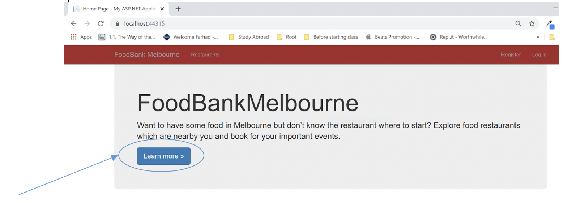
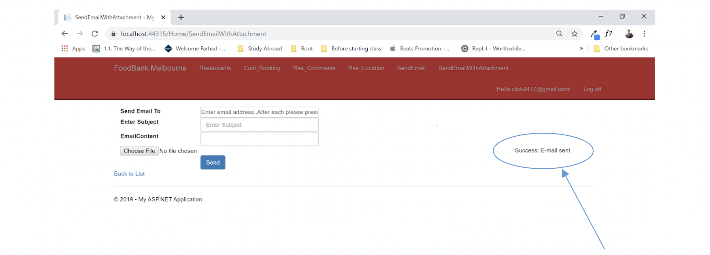
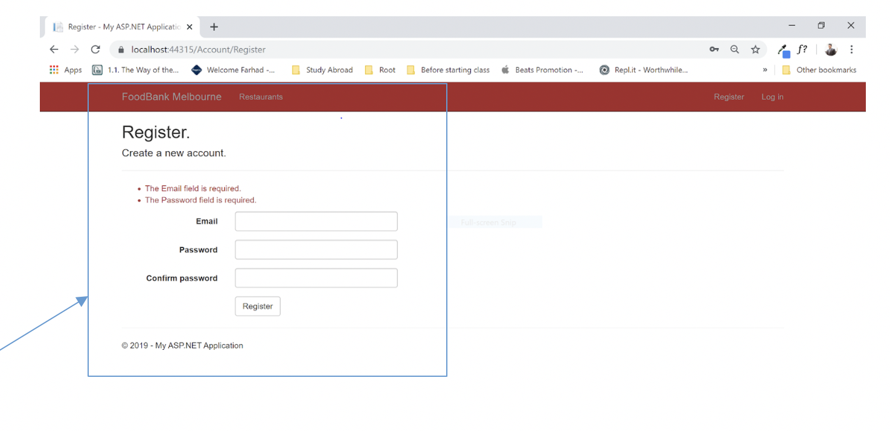
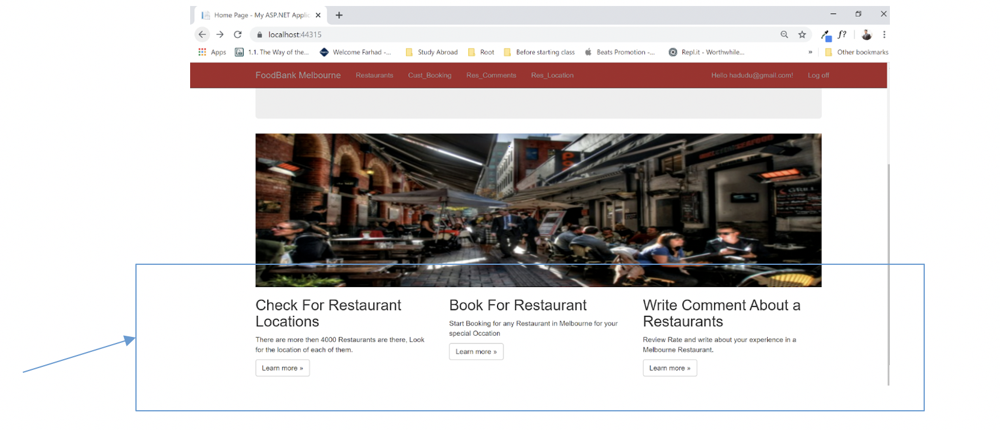
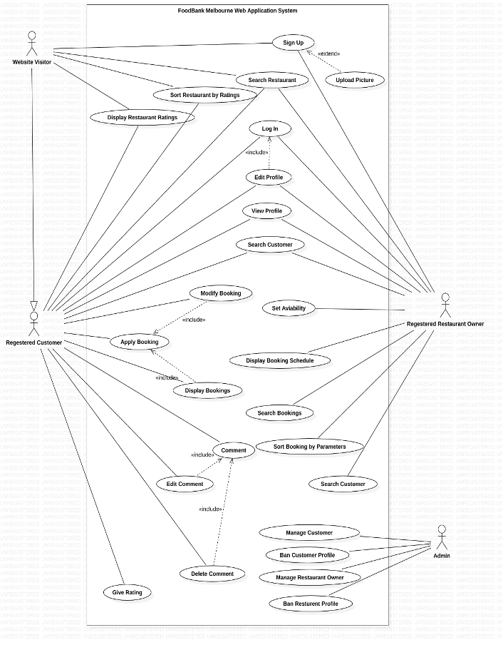
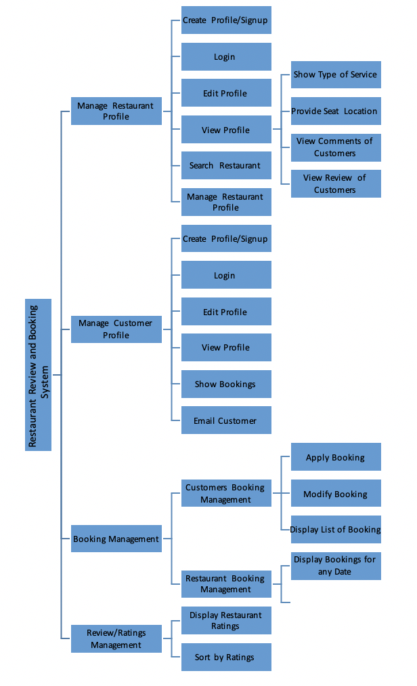
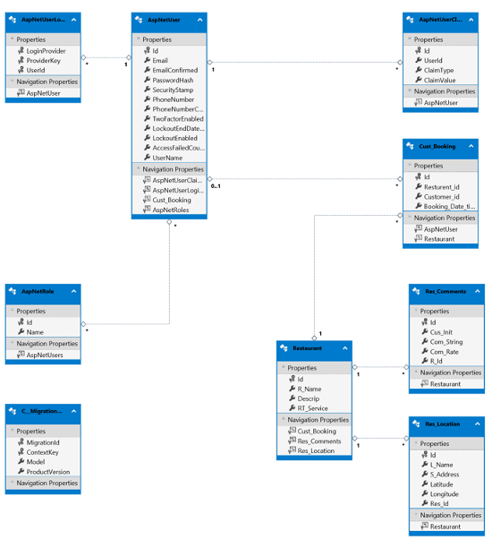

## Introduction
A website that helps restaurant-goers of Melbourne by providing information about nearby restaurants. The website also gives them the ability to book, comment on service, provide ratings, and search restaurants using the customized location based search option.

## Functionality Overview
- Provide Restaurant Information of Melbourne
- Customer can reserve a booking for a Restaurant for a couple of hours
- Customer can provide comment and review into the web application
- Customer can provide ratings for the Restaurant
- Customers can search for Restaurants by Location.

## Usability Design Overview
This project made an effort to follow Donald Norman's principle of design, illustrating the following points.

1. Visibility: The visibility feature of Donald Norman's principle of design refers to the concept that the more eye-catching and visible a content is, the more useful is intended to know about that content.

2. Feedback: The Feedback principle ensures the user can see what he has done following his action at an immediate state. In sort, the Feedback feature ensures that the user is not confused about what he has done as a feedback.

3. Constraints: With the help of constraints, users do not have repetitive interaction in the website, helping them to step by step go at the end of the process.

4. Consistency: Consistent design can be referred to as intuitive design, which means people can send knowledge and learn new things without much hassle in the platform. Besides consistency helps the user to recognize and apply patterns.

## Analysis and Design Manifests
#### 1. Use case diagram

#### 2. Functional Diagram

#### 3. Class Diagram and Data Dictionary
##### Class Diagram

##### Data Dictionary:
###### Restaurant Table:

| Name        | Type          | Description                              |
| ----------- | ------------- | ---------------------------------------- |
| Id          | int           | Primary Key                              |
| R_Name      | nvarchar(MAX) | Restaurant Name                          |
| Descrip     | nvarchar(MAX) | Description Name                         |
| DRT_Service | nvarchar(MAX) | Type of service, like Outdoor, or Indoor |

###### Res_Location Table:

| Name      | Type          | Description                               |
| --------- | ------------- | ----------------------------------------- |
| Id        | int           | Primary Key                               |
| L_Name    | varchar(MAX)  | Restaurant Name                           |
| S_Address | varchar(MAX)  | Street Address Description                |
| Latitude  | numeric(10,8) | Numeric, can be minus values as well      |
| Longitude | numeric(11,8) | Numeric, can be minus values as well      |
| Res_Id    | int           | Foreign key, referencing Restaurant table |

###### Res_Comments Table:

| Name       | Type          | Description                                  |
| ---------- | ------------- | -------------------------------------------- |
| Id         | int           | Pmary Key                                    |
| Cus_Init   | nvarchar(MAX) | Customer Initial, name of the comment writer |
| Com_String | nvarchar(MAX) | Full comment section                         |
| Com_Rate   | decimal(2,1)  | Ratings                                      |
| R_Id       | int           | Foreign key, referencing Restaurant table    |

###### Cust_Booking Table:

| Name              | Type          | Description                              |
| ----------------- | ------------- | ---------------------------------------- |
| Id                | int           | Primary Key                              |
| Resturant_id      | int           | Foreign key, refering restaurant table   |
| Customer_id       | nvarchar(128) | Foreign key, refering AspNetUsers        |
| Booking_Date_time | datetime      | Date time formet to save date of booking |

## Development Methodology:
### Used Code and Fix Method

Code and Fix Method as the name implies, is the looping process of Coding and Fixing. For my Assignment Portfolio, and eFolio Tasks in this repo I did the coding first most of the time and fix the errors that I get from the mistakes.

### Versioning:

Handled my version control using GIT command line tool for Windows known as GIT Bash.
